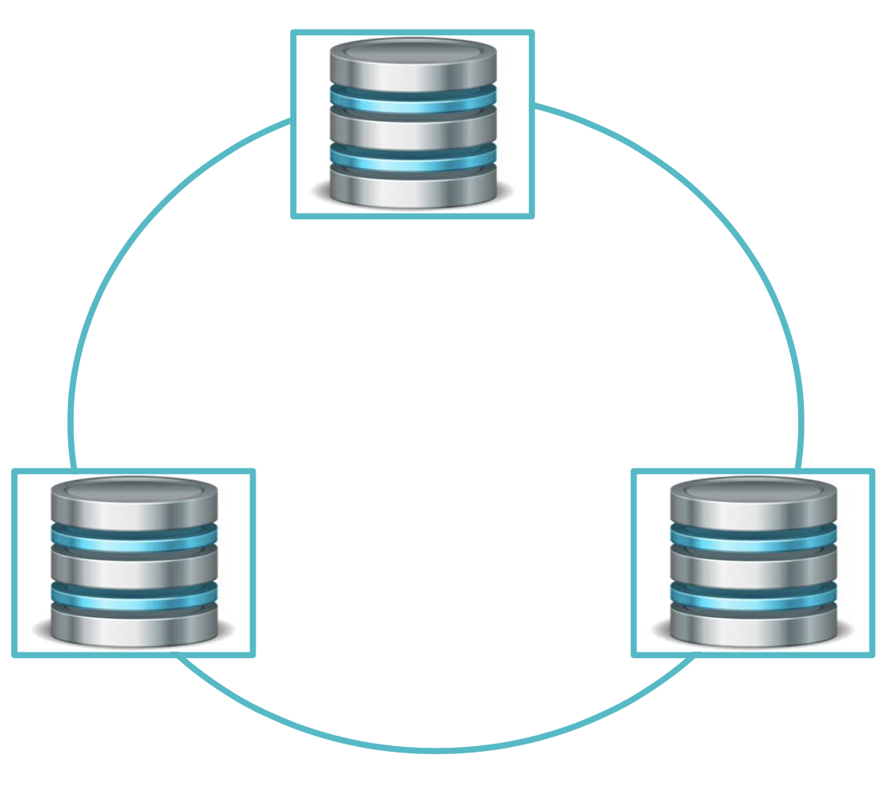

# PXC Break/Fix Tutorial

In this tutorial, we'll walk through over several scenarios where things can get complex with your Percona XtraDB Cluster (PXC)/Galera installation. We will break things in these scenarios and then you'll have a chance to diagnose and fix them. Learn some of the most complex troubleshooting techniques. 

This tutorial assume that you are somehow familar with the Percona XtraDB Cluster.

## Galera focus points

When talking about Galera, the key points consists on the following layers:

- State Transfer: Boostraping, Node joining/leaving. Data replication
- Quorum: Primary Component. Cluster stability
- Data consistency: Making Multi-Master (Certification), Flow Control.

Besides the omnipresent topic on databases, and our reason to live: **Performance.**

All the scenarios will take place on a basic 3-node PXC Cluster

Let's create it. 

### Step 1: [Build the environment](docs/Build_the_environment.md)

### Step 2: [Launch the cluster](docs/Launch_the_cluster.md)

## [Sysbench](docs/Sysbench.md)

## [PMM](docs/PMM.md)

# Cases

## State Transfer

### [Ports](docs/Ports.md)

### [State Transfers](docs/State_Transfers.md)

### [Group communication](docs/Group_communication.md)

## Quorum

### [Quorum](docs/Quorum.md)

### [WAN](docs/WAN.md)

### [Partition Handling (Network Hiccup)](docs/Partition_Handling.md)

### [GTID](docs/GTID.md)

## Data Consistency

### [Flow control](docs/Flow_control.MD)

### [PXC Strict Mode](docs/PXC_Strict_Mode.md)

### [GRA Files](docs/GRA_Files.md)

### [Auto increment](docs/Auto_increment.md)

### [Data Consistency](docs/Data_Consistency.md)

### [Multi Master](docs/Multi_Master.md)

### [Schema Requirements](docs/Schema_Requirements.md)

### [Multi thread](docs/Multi_thread.md)

## 

